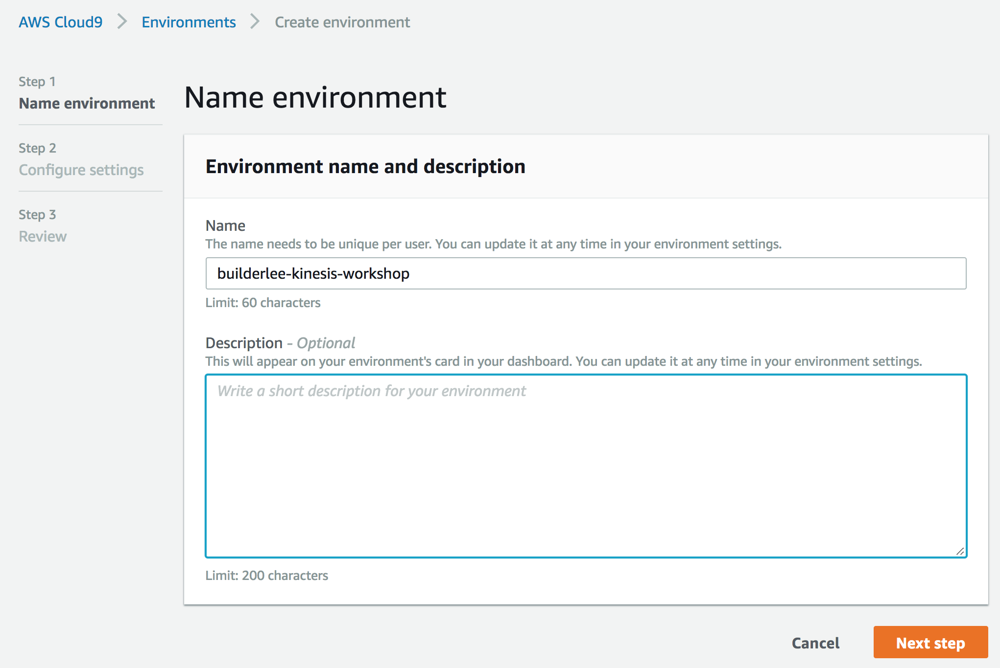
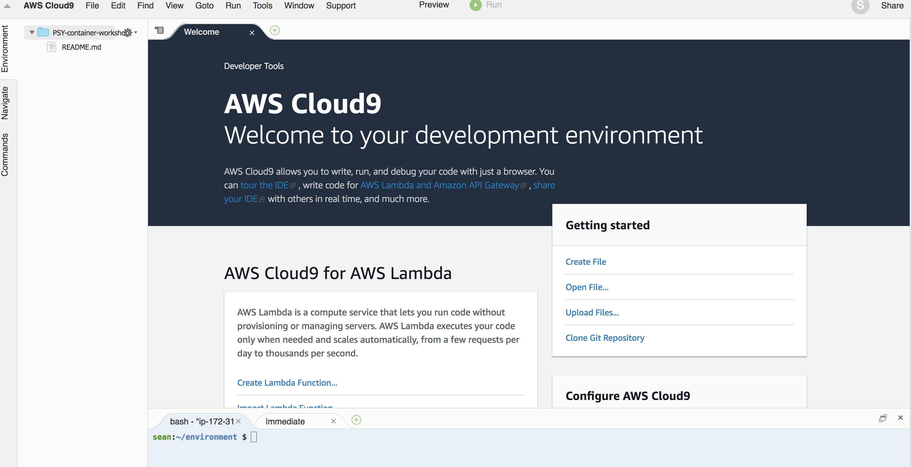

## Preparing a your Lab environment

- This module is for configuring your dev environment
- We will be using Cloud9, a cloud-based IDE environment that let's you write, run, and debug your code with just a browser
- Cloud9 comes prepackaged with essential tools for popular programming languages, including JavaScript, Python, PHP, and more, so you don’t need to install files or configure your development machine to start new projects

## 1. Using Cloud9

### 1.1. Create your Cloud9 environments

##### Launch your instance

- Use the Singapore region!

1.  In the AWS Console, search for **Cloud9** under AWS Services and select **Cloud9**.

2.  Select **Create environment**

3.  Specify Environment name : **[iamuser-kinesis-workshop]**



4.  Select **Next step**

5.  Select **Create a new instance for envinronment (EC2)**

6.  Select **t2.micro**

7.  Select **Next step**

8.  Select **Create environment**

##### Open your environment



### 1.2 Update your environment

1.  Run the yum update command to help ensure the latest security updates and bug fixes are installed

```
$ sudo yum -y update
```

### 1.3 Create a working directory for this workshop

1.  Create folder, and change current directory

```
$ mkdir kinesis-workshop

$ cd kinesis-workshop
```

2.  Configure Git credential helper included in the AWS CLI. The credential helper allows Git to use HTTPS and a cryptographically signed version of your IAM user credentials or Amazon EC2 instance role whenever Git needs to authenticate with AWS to interact with AWS CodeCommit repositories.

```
$ git config --global credential.helper '!aws codecommit credential-helper $@'
$ git config --global credential.UseHttpPath true
```

### 1.4 Update your Python environment

1.  Check Python version and check the location of Node

```
$ python -V
Python 2.7.14

$ which python
alias python='python27'
        /usr/bin/python27
```

2.  Install boto3:

```
sudo python -m pip install boto3
```

### 1.5 Update AWS CLI

1.  Update awscli

```
pip install awscli --upgrade --user
```

We're done, continue to [Part 1 : Data Ingestion with Kinesis Firehose](./doc-module-01.md)
