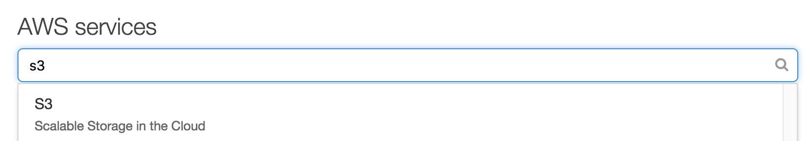

## Lab 1 : Data Ingestion with Kinesis Firehose

In this module, we will create a Kinesis Firehose Delivery Stream to ingest data and deliver it to a staging S3 bucket.

We will need to create 2 buckets, one to store the raw data ingested by Kinesis Firehose, and another staging bucket to hold data to be consumed by our batch based analytics

### 1. Create S3 Buckets

#### 1.1 Create Raw Data Bucket

1.  In the AWS Console, search for **S3** under AWS Services and select it

2.  Select **Create bucket**

- Choose a name for your S3 bucket, the S3 bucket namespace is global, so you'll need to pick a unique name. Include your IAM user to help identify your bucket and make it unique: **[iamuser-raw-bucket]**. In my example, I'll be going with **builderlee-raw-bucket**
- Ensure the Region selected is **Asia Pacific (Singapore)**
- Select **Create**

#### 1.2 Create Staging Data Bucket

1.  Select **Create bucket**

- Enter **[iamuser-staging-bucket]** as the bucket name. In my example, I'll be going with **builderlee-staging-bucket**
- Ensure the Region selected is **Asia Pacific (Singapore)**
- Select **Create**

### 2. Create Kinesis Firehose Delivery Stream

1.  In the AWS Console, select **Services** at the top and enter **kinesis**, and select **Kinesis**

2.  At the welcome screen, select **Get started**, followed by **Create delivery stream**

- Step 1: Name and source - Use **[iamuser-firehose]** as the **Delivery stream name**, leave the remaining settings as default and select **Next**
- Step 2: Process records - Leave the default settings and select **Next**
- Step 3: Choose destination - Under S3 bucket, choose your raw bucket **[iamuser-raw-bucket]**, and select **Next**
- Step 4: Configure settings - Change the **Buffer interval** to 60 seconds. Under IAM role, select **Create new or choose**. On the new tab, enter **[iamuser_firehose_delivery_role]** as the Role Name and select **Allow**. Select **Next**
- Step 5: Review - Select **Create delivery stream**

**Note**: We need to create an IAM role to give Firehose service permissions to deliver files to our S3 buckets.

Our Kinesis Firehose delivery stream is now ready to ingest and deliver data to the configured S3 buckets.

We're done, continue to [Part 2 : Deployment with Elastic Beanstalk Command Line Interface (CLI)](./doc-module-02.md)
