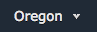

## Simulating Real-Time Data Ingestion with Kinesis Data Generator (KDG)

For the sake of this lab, we will be using Amazon Kinesis Data Generator (KDG) to simulate a live stream of data. This a a tool open sourced by AWS available on: https://awslabs.github.io/amazon-kinesis-data-generator/web/help.html

### 1. Create a Cognito User

In order to use this tool, you'll need to create an Amazon Cognito user in your AWS account with permissions to send data to Kinesis. We provide a CloudFormation script to automate this for you.

CloudFormation templates allows you specify AWS resources with code, which the CloudFormation service can provision for you.

#### 1.1 Create Cognito User with CloudFormation

1.  Go to https://awslabs.github.io/amazon-kinesis-data-generator/web/help.html

2.  Select **Create a cognito User with CloudFormation**, which will launch it in a new browser tab

3.  Now complete the CloudFormation template to create the resources:

Ensure the region at the top right corner is **Oregon**:



**Note**: While the cognito user KDG will use is created in Oregon region, the target Kinesis Firehose can be in Singapore region

- Part 1: Select Template - Select **Next**
- Part 2: Specify Details - Enter **[iamuser-kinesis-generator]** as the stack name. Enter **[iamuser-kinesis-user]** as the username and choose a strong password. Select **Next**
- Part 3: Options - Leave the default settings and select **Next**
- Part 4: Review - Select the checkbox for **I acknowledge that AWS CloudFormation might create IAM resources**. Select **Create**

4.  To get the URL to access KDG, expands the Outputs dropdown:


#### 1.2 Validate the newly created Cognito User

1.  Enter the **[iamuser-kinesis-generator]** and password you used earlier in the top right corner to login

### 2. Start Sending Data to Kinesis Firehose

We can now simulate a data stream with KDG

#### 2.1 Configure the Generator

Enter the following details:

1.  Region: **ap-southeast-1** (Singapore)
2.  Stream/Delivery stream: **[iamuser-firehose]**
3.  Records per second: 100

#### 2.2. Specify Data Model of records

1.

```
{
  "apMac": "00-40-96-01-23-45",
  "apTags": ["AP1","Capital Square"],
  "apFloors": ["1"],
  "observations": [
    {
      "clientMac": "c4:b3:02:d4:54:14",
      "ipv4": "/111.65.32.53",
      "ipv6": null,
      "seenTime": "{{date.utc("YYYY-MM-DD HH:mm:ss.SSS")}}",
      "seenEpoch": "integer",
      "ssid": "fabian-note-8",
      "rssi": "integer",
      "manufacturer": "Samsung",
      "os": "Android Oreo",
      "location": {
        "lat": 1.290270,
        "lng": 1.290270,
        "unc": 1,
        "x": "[<decimal>, ...]",
        "y": "[<decimal>, ...]"
      }
    }
  ]
}
```

#### 2.3 Send Data to Kinesis Firehose & Validate Delivery

1.  Select **Send Data**

2.  Select **Stop Sending Data to Kinesis** once you've sent at least 2000 records:


3.  We will now take a look at the data ingested by Kinesis Firehose and delivered to S3. In the AWS Console, search for **S3** under AWS Services and select it

4.  Select the **[iamuser-raw-bucket]** bucket, and notice the folder structure follows a **"YYYY/MM/DD/HH" UTC** time format to split the data. This is the default structure firehose uses, but is configurable by users.

You can read more about changing the prefix here: https://docs.aws.amazon.com/firehose/latest/dev/create-destination.html#create-destination-s3

5.  Keep entering each subfolder until you reach the files:


6.  Kinesis Firehose will split files up based on your buffer settings, remember we set our buffer at 1MB and 60 settings. This means Kinesis Firehose will deliver a file once either 60 seconds or passed or 1MB of data has been ingested, whichever happens first.

7.  Select a file, select **Download**, and open up the file in a text editor. Notice the JSON has been delivered to our S3 bucket in it's raw form, in a newline delimited format:


We're done! continue to [Part 3 : Running Batch Jobs with AWS Batch](./doc-module-03.md)
