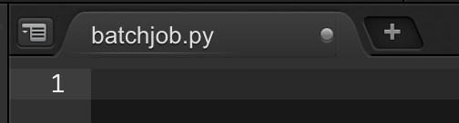

## Creating a Sample Python Application

We'll be building a sample Python application. When building application that run on AWS, most developers want to take advantage of our managed services in a programmatic manner. boto3, the AWS SDK for Python, allows Python developers to write software that makes use of services like S3.

### 1. Create Sample Application

This sample application will:

1.  Pull the daily data from your **[iamuser-raw-bucket]** S3 bucket delivered by Kinesis Firehose.
2.  It'll merge the various files delivered into a single line-delimited JSON file and upload it to **[iamuser-workbooks]** S3 bucket

The purpose of this application is simulate data processing and boilerplate code required to interact with S3 as part of an analytics processing workflow, rather than an actual analytics processing which is up to the developer to implement.

#### 1.1 Using the Cloud9 IDE Environment

We'll be using the Cloud9 environment created in **Part 0** of the lab.

1.  In the AWS Console, search for **Cloud9** under AWS Services and select **Cloud9**.

2.  Select **Open IDE** to use the Cloud9 IDE environment in a new tab:


3.  At the bottom of the screen, there will be a terminal window:


Cloud9 runs on an Amazon Linux distribution, which gives us a convenient bash shell to use.Check your current directory:

```
$ pwd
/home/ec2-user/environment
```

4.  Ensure your current directory is **/home/ec2-user/environment**, if it isn't, run the following command to change to it:

```
$ cd /home/ec2-user/environment
```

5.  Make a new working directory for our lab:

```
$ mkdir kinesis-workshop
```

6.  Create a python file:

```
$ touch batchjob.py
```

7.  The file will now appear on the file explorer pane on the left:


8.  Double click the file to edit the file in the visual editor:



9.  Paste the following sample code into the file:

```
import boto3
import datetime
import botocore
import os, errno, shutil

## Configuration
now = datetime.date.today()
YEAR = str(now.year).zfill(4)
MONTH = str(now.month).zfill(2)
DAY = str(now.day).zfill(2)
PREFIX = YEAR+'/'+MONTH+'/'+DAY+'/'
print (PREFIX)
RAW_BUCKET = '[iamuser-raw-bucket]' # replace with your S3 bucket name for [iamuser-raw-bucket]
WORKBOOK_BUCKET = '[iamuser-workbooks]' # replace with your S3 bucket name for [iamuser-workbooks]
SCRATCH = 'scratch'
OUTPUT_FILE = '[iamuser_output_file.json]' # replace with [iamuser_output_file.json]

## Instantiate S3 object via boto3
s3 = boto3.resource('s3')
sg_bucket = s3.Bucket(RAW_BUCKET)

## Create scratch space
try:
    os.makedirs(SCRATCH)
except OSError as e:
    if e.errno != errno.EEXIST:
        raise

## Download all data files for the day
for obj in sg_bucket.objects.filter(Prefix=PREFIX):
    #print(obj.key)
    if len(str(obj.key)) > 15:
        #print('longer than 15')
        print(obj.key)
        try:
            sg_bucket.download_file(obj.key, SCRATCH+'/'+obj.key[-78:])
        except botocore.exceptions.ClientError as e:
            if e.response['Error']['Code'] == "404":
                print("The object does not exist.")
            else:
                raise

## Merge Files
with open(OUTPUT_FILE,'wb') as wfd:
    for f in os.listdir(SCRATCH):
        print(f)
        with open(SCRATCH+'/'+f,'rb') as fd:
            shutil.copyfileobj(fd, wfd, 1024*1024*10)

## Upload processed JSON to Workbook Bucket
wb_bucket = s3.Bucket(WORKBOOK_BUCKET)
wb_bucket.upload_file(OUTPUT_FILE, PREFIX+OUTPUT_FILE)
```

10. You'll need to change a number of parameters under the configuration:

- **RAW_BUCKET**: The name of your raw S3 bucket **[iamuser-staging-bucket]**
- **WORKBOOK_BUCKET**: The name of your Workbooks bucket **[iamuser-workbooks]**
- **OUTPUT_FILE**: The name of your processed file to be uploaded back to S3 **[iamuser_output_file.json]**

11. Run the python script to test your batch job:

```
$ python batchjob.py
```

You should see an output similar to the screenshot below:


12. To validate the **[iamuser_output_file.json]** file has been uploaded to S3, run the following command or view the bucket via the AWS console:

```
$  s3 ls builderlee-workbooks --recursive
```

Console:


#### 1.2 Create Containerised Batch Job

AWS Batch supports any job that can be executed as a Docker container. Containerising a Python script is relatively simple compared to a full blown web application, and provides many benefits as you have a self contained image then is built programmatically, and abstracts the underlying infrastructure from the runtime environment.

1.  Ensure you are in the lab working directory:

```
$ pwd
/home/ec2-user/environment/kinesis-workshop
```

2.  Create a Dockerfile:

```
$ touch Dockerfile
```

3.  Double click **Dockerfile** to edit the file in the visual editor, and add the following code:

```
FROM amazonlinux:latest

RUN yum -y update
RUN curl -O https://bootstrap.pypa.io/get-pip.py
RUN python get-pip.py --user
RUN python -m pip install boto3
ADD batchjob.py /usr/local/bin/batchjob.py
RUN chmod a+x /usr/local/bin/batchjob.py
WORKDIR /tmp
USER nobody

ENTRYPOINT ["python", "/usr/local/bin/batchjob.py"]
```

4.  Build Docker image:

```
$ docker build -t builderlee-repo/batchjob .
```

5.  After the build completes, tag your image so you can push the image to this repository:

```
$ docker tag builderlee-repo/batchjob:latest 327377359968.dkr.ecr.ap-southeast-1.amazonaws.com/builderlee-repo:latest
```

6.  Run the following command to view your newly built and tagged image:

```
$ docker images
REPOSITORY                                                          TAG                 IMAGE ID            CREATED             SIZE
327377359968.dkr.ecr.ap-southeast-1.amazonaws.com/builderlee-repo   latest              0d028ad43a87        9 minutes ago       301MB
```

7.  Before we can push our image to ECR, we need to get the login credentials with the following command:

```
$ $(aws ecr get-login --no-include-email --region ap-southeast-1)

WARNING! Using --password via the CLI is insecure. Use --password-stdin.
WARNING! Your password will be stored unencrypted in /home/ec2-user/.docker/config.json.
Configure a credential helper to remove this warning. See
https://docs.docker.com/engine/reference/commandline/login/#credentials-store

Login Succeeded
```

#### 1.2 Validate the newly created Cognito User

1.  In the AWS Console, search for **Batch** under AWS Services and select it.

2.  If you currently don't have any resource sconfigured in AWS Batch, you'll be greeted with the **Getting Started** page. Select **Get started**:


3.  However, we will not be using the getting started Wizard, but create each Batch component individually (Compute Environment, Job Definition etc.) to get a deeper understanding in the dependencies. Select **Cancel** at the bottom right:


4.  Select **Job Definition** from the left menu

5.  Enter **[iamuser-job-def]** as the **Job definition name**

### 2. Start Sending Data to Kinesis Firehose

We can now simulate a data stream with KDG

#### 2.1 Configure the Generator

Enter the following details:

1.  Region: **ap-southeast-1** (Singapore)
2.  Stream/Delivery stream: **[iamuser-firehose]**
3.  Records per second: 100

#### 2.2. Specify Data Model of records

1.

```
{
"apMac": "00-40-96-01-23-45",
"apTags": ["AP1","Capital Square"],
"apFloors": ["1"],
"observations": [
{
"clientMac": "c4:b3:02:d4:54:14",
"ipv4": "/111.65.32.53",
"ipv6": null,
"seenTime": "{{date.utc("YYYY-MM-DD HH:mm:ss.SSS")}}",
"seenEpoch": "integer",
"ssid": "fabian-note-8",
"rssi": "integer",
"manufacturer": "Samsung",
"os": "Android Oreo",
"location": {
"lat": 1.290270,
"lng": 1.290270,
"unc": 1,
"x": "[<decimal>, ...]",
"y": "[<decimal>, ...]"
}
}
]
}
```

#### 2.3 Send Data to Kinesis Firehose & Validate Delivery

1.  Select **Send Data**

2.  Select **Stop Sending Data to Kinesis** once you've sent at least 2000 records:


3.  We will now take a look at the data ingested by Kinesis Firehose and delivered to S3. In the AWS Console, search for **S3** under AWS Services and select it

4.  Select the **[iamuser-raw-bucket]** bucket, and notice the folder structure follows a **"YYYY/MM/DD/HH" UTC** time format to split the data. This is the default structure firehose uses, but is configurable by users.

You can read more about changing the prefix here: https://docs.aws.amazon.com/firehose/latest/dev/create-destination.html#create-destination-s3

5.  Keep entering each subfolder until you reach the files:


6.  Kinesis Firehose will split files up based on your buffer settings, remember we set our buffer at 1MB and 60 settings. This means Kinesis Firehose will deliver a file once either 60 seconds or passed or 1MB of data has been ingested, whichever happens first.

7.  Select a file, select **Download**, and open up the file in a text editor. Notice the JSON has been delivered to our S3 bucket in it's raw form, in a newline delimited format:


We're done! continue to [Lab 3 : Running Batch Jobs with AWS Batch](./doc-module-03.md)

```

```

```

```

```

```
