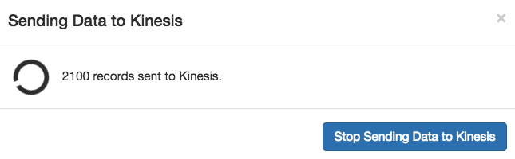
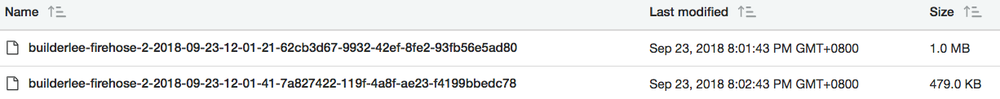

## Running Batch Jobs with AWS Batch

AWS Batch is a set of batch management capabilities that enables developers, scientists, and engineers to easily and efficiently run hundreds of thousands of batch computing jobs on AWS. AWS Batch dynamically provisions the optimal quantity and type of compute resources (e.g., CPU or memory optimized instances) based on the volume and specific resource requirements of the batch jobs submitted. With AWS Batch, there is no need to install and manage batch computing software or server clusters, allowing you to instead focus on analyzing results and solving problems. AWS Batch plans, schedules, and executes your batch computing workloads using Amazon EC2 and Spot Instances.

### 1. Configure AWS Batch

There are a few components you'll need to get familiar with AWS Batch:

1.  **Compute Environment**: Compute resources used to run the actual jobs. Environments are flexible as you can set it up to only use a particular type of EC2 instance like m4.large & c5.large, or specify the minimum/desired/maximum vCPUs and let AWS Batch pick the optimal instances. Because batch jobs do not usually require persistent running EC2 servers, spot instances can also be leveraged to increase cost effectiveness, with savings of up to 90% when compared to on-demand EC2 instances.

2.  **Job Definitions**: A job definition specifies how jobs are to be run. Think of it as a blueprint for the batch job which defines the resources required to run, ranging from vCPU, RAM, storage to the IAM permissions required so it can access other AWS Services programmatically. Job definitions can also be overwritten when submitted programmatically.

3.  **Job Queues**: When you submit an AWS Batch job, you submit it to a particular job queue, where it resides until it is scheduled onto a compute environment.

**Reference**: https://docs.aws.amazon.com/batch/latest/userguide/what-is-batch.html

#### 1.1 Create Containerised Batch Job

We will be building a docker container to run our batch job, which simplifies continuous development and deployment of our code. There are many benefits of using containers in general which we will not be diving deep into today, but one benefit with batch is that your code is no longer tied to the Amazon Machine Image (AMI) used to launch the batch job, but rather, self-contained inside a docker image which is decoupled from the underlying infrastructure.

1.  In the AWS Console, search for **ECS** under AWS Services and select Elastic Container Service.

2.  Select **Repositories** on the left menu

3.  Select **Get started**

4.  Enter **[iamuser-repo]** as the **Repository name**

5.  Select **Next step**


3.  However, we will not be using the getting started Wizard, but create each Batch component individually (Compute Environment, Job Definition etc.) to get a deeper understanding in the dependencies. Select **Cancel** at the bottom right:


4.  Select **Job Definition** from the left menu

5.  Enter **[iamuser-job-def]** as the **Job definition name**

#### 1.2 Validate the newly created Cognito User

1.  In the AWS Console, search for **Batch** under AWS Services and select it.

2.  If you currently don't have any resource sconfigured in AWS Batch, you'll be greeted with the **Getting Started** page. Select **Get started**:


3.  However, we will not be using the getting started Wizard, but create each Batch component individually (Compute Environment, Job Definition etc.) to get a deeper understanding in the dependencies. Select **Cancel** at the bottom right:


4.  Select **Job Definition** from the left menu

5.  Enter **[iamuser-job-def]** as the **Job definition name**

### 2. Start Sending Data to Kinesis Firehose

We can now simulate a data stream with KDG

#### 2.1 Configure the Generator

Enter the following details:

1.  Region: **ap-southeast-1** (Singapore)
2.  Stream/Delivery stream: **[iamuser-firehose]**
3.  Records per second: 100

#### 2.2. Specify Data Model of records

1.

```
{
  "apMac": "00-40-96-01-23-45",
  "apTags": ["AP1","Capital Square"],
  "apFloors": ["1"],
  "observations": [
    {
      "clientMac": "c4:b3:02:d4:54:14",
      "ipv4": "/111.65.32.53",
      "ipv6": null,
      "seenTime": "{{date.utc("YYYY-MM-DD HH:mm:ss.SSS")}}",
      "seenEpoch": "integer",
      "ssid": "fabian-note-8",
      "rssi": "integer",
      "manufacturer": "Samsung",
      "os": "Android Oreo",
      "location": {
        "lat": 1.290270,
        "lng": 1.290270,
        "unc": 1,
        "x": "[<decimal>, ...]",
        "y": "[<decimal>, ...]"
      }
    }
  ]
}
```

#### 2.3 Send Data to Kinesis Firehose & Validate Delivery

1.  Select **Send Data**

2.  Select **Stop Sending Data to Kinesis** once you've sent at least 2000 records:



3.  We will now take a look at the data ingested by Kinesis Firehose and delivered to S3. In the AWS Console, search for **S3** under AWS Services and select it

4.  Select the **[iamuser-raw-bucket]** bucket, and notice the folder structure follows a **"YYYY/MM/DD/HH" UTC** time format to split the data. This is the default structure firehose uses, but is configurable by users.

You can read more about changing the prefix here: https://docs.aws.amazon.com/firehose/latest/dev/create-destination.html#create-destination-s3

5.  Keep entering each subfolder until you reach the files:



6.  Kinesis Firehose will split files up based on your buffer settings, remember we set our buffer at 1MB and 60 settings. This means Kinesis Firehose will deliver a file once either 60 seconds or passed or 1MB of data has been ingested, whichever happens first.

7.  Select a file, select **Download**, and open up the file in a text editor. Notice the JSON has been delivered to our S3 bucket in it's raw form, in a newline delimited format:


We're done! continue to [Lab 3 : Running Batch Jobs with AWS Batch](./doc-module-03.md)

```

```
