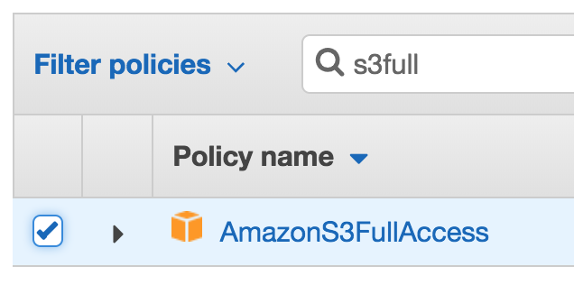
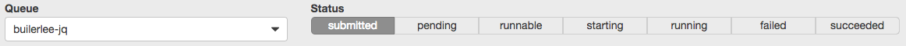

## Running Batch Jobs with AWS Batch

AWS Batch is a set of batch management capabilities that enables developers, scientists, and engineers to easily and efficiently run hundreds of thousands of batch computing jobs on AWS. AWS Batch dynamically provisions the optimal quantity and type of compute resources (e.g., CPU or memory optimized instances) based on the volume and specific resource requirements of the batch jobs submitted. With AWS Batch, there is no need to install and manage batch computing software or server clusters, allowing you to instead focus on analyzing results and solving problems. AWS Batch plans, schedules, and executes your batch computing workloads using Amazon EC2 and Spot Instances.

### 1. Configure AWS Batch

There are a few components you'll need to get familiar with AWS Batch:

1.  **Compute Environment**: Compute resources used to run the actual jobs. Environments are flexible as you can set it up to only use a particular type of EC2 instance like m4.large & c5.large, or specify the minimum/desired/maximum vCPUs and let AWS Batch pick the optimal instances. Because batch jobs do not usually require persistent running EC2 servers, spot instances can also be leveraged to increase cost effectiveness, with savings of up to 90% when compared to on-demand EC2 instances.

2.  **Job Definitions**: A job definition specifies how jobs are to be run. Think of it as a blueprint for the batch job which defines the resources required to run, ranging from vCPU, RAM, storage to the IAM permissions required so it can access other AWS Services programmatically. Job definitions can also be overwritten when submitted programmatically.

3.  **Job Queues**: When you submit an AWS Batch job, you submit it to a particular job queue, where it resides until it is scheduled onto a compute environment.

**Reference**: https://docs.aws.amazon.com/batch/latest/userguide/what-is-batch.html

#### 1.1 Create IAM Instance Role for AWS Batch Instances

1.  As a best practice, when your containerised batch job runs on an EC2 instance, you should rely on the EC2 instance role of the underlying EC2 instance to retrieve temporary credentials to access AWS resources (S3) instead of passing in permanent credentials into the container directly in the code.

2.  We will now create the EC2 instance role with permissions for S3. In the AWS Console, search for **IAM** under AWS Services and select **IAM**.

3.  Select **Roles** on the left menu

4.  Select **Create role**

5.  Select **Elastic Container Service**

6.  Select **Elastic Container Service Task**

7.  Select **Next: Permissions**

8.  In the search bar, enter **s3full**, and select the checkbox for **AmazonS3FullAccess**:

8.  Select **Next: Review**

9.  Enter **[iamuser-jobrole]** as the **Role name**, and select **Create role**

**Note**: For the purpose of this lab, we will be giving full S3 permissions. However, as a Security best practice, you should follow the principle of least privilege and only grant the minimum amount of permissions needed based on your application's requirements

#### 1.2 Create Compute Environment

1.  In the AWS Console, search for **Batch** under AWS Services and select it.

2.  If you currently don't have any resource sconfigured in AWS Batch, you'll be greeted with the **Getting Started** page. Select **Get started**:

3.  However, we will not be using the getting started Wizard, but create each Batch component individually (Compute Environment, Job Definition etc.) to get a deeper understanding in the dependencies. Select **Cancel** at the bottom right

4.  Select **Compute Environment** from the left menu

5.  Enter the following details:

- **Compute environment name**: [iamuser-env]
- **Service role**: Create new role
- **Instance role**: Create new role

In the interest of time, we will be setting the **Minimum vCPUs** and **Desired vCPUs** to 2, which will keep at leat 1 persistent server running even when there are no jobs. For better cost effectiveness, a minimum and desired of 0 will suffice, and AWS Batch will spin up a server only when a job is submitted.

- **Minimum vCPUs**: 2
- **Desired vCPUs**: 2

Leave the remaining settings as default and select **Create**

#### 1.3 Create Job Queue

1.  Select **Job Queues** on the left menu

2.  Select **Create queue**

3.  Enter the following details:

- **Queue name**: [iamuser-jq]
- **Priority**: 1
- **Select a compute environment**: [iamuser-env]

Select **Create**

#### 1.4 Create Job Defnition

1.  Select **Job definitions** from the left menu

2.  Select **Create**

3.  Enter the following details:

- **Job definition name**: [iamuser-jdef]
- **Job role**: [iamuser-jobrole]
- **Container image**: [awsaccountid].dkr.ecr.ap-southeast-1.amazonaws.com/[iamuser-repo]:latest
  **Note**: This is the image identifier we used at the end of part 3 in our **docker push** command
- **User**: nobody

Select **Create job definition**

### 2. Submit Job to AWS Batch

#### 2.1 Submit Job

1.  Select **Jobs** on the left menu

2.  Select **Submit job**

3.  Enter the following details:

- **Job name**: [iamuser-jobname]
- **Job defnition**: [iamuser-jdef]:1
- **Job queue**: [iamuser-jq]

Leave the remaining settings as default and select **Submit job**

We're done! continue to [Lab 3 : Running Batch Jobs with AWS Batch](./doc-module-03.md)

### 3. Monitor Job Status

Simple metrics for jobs submitted to an AWS Batch Job Queue can be monitored within the console

1.  Select **Jobs** on the left menu

2.  Jobs can be monitored based on Job Queue, as well as the Job Status:

3.  As we configured out compute environment to have a minimum of 2 vCPUs, chances are the persistent server running has already picked up the job to execute. Therefore, you might not see your recently submitted job under the **submitted** status.

4.  Select **succeeded**
